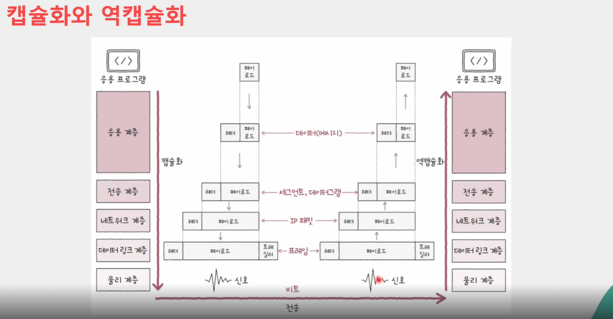

### [네트워크 미시적으로 살펴보기 (3) 캡슐화와 역캡슐화](https://www.inflearn.com/courses/lecture?courseId=335940&unitId=261905)

## 캡슐화 와 역캡슐화

### 캡슐화

- 계층 별 프로토콜의 목적과 특징에 부합하는 헤더(트레일러) 추가
- 각 계층별 프로토콜의 목적과 특징에 부합하는 헤드가 추가되어 나가는 과정을 캡슐화라고 함
- 상위 계층으로부터 내려받은 패킷을 페이로드로 삼아, 프로토콜에 걸맞는 헤더(혹은 트레일러)를 덧붙인 후 하위 계층으로 전달
- 상위 계층의 패킷은 하위계층의 페이로드로 간주

### 역캡슐화

- 계층 별 프로토콜의 목적과 특징에 부합하는 헤더 제거

### PDU

- 각 계층에서 송수신되는 메시지 단위
- 현재 계층의 PDU = 상위 계층 데이터 + 현재 계층의 프로토콜 및 헤더(및 트레일러)
- 응용, 표현, 세션 -> 데이터(data)
- 전송 -> 세그먼트(segement), 데이터그램(datagram)
- 네트워크 -> 패킷(packet)
- 데이터 링크  -> 프레임(frame)
- 물리 -> 비트(bit)

